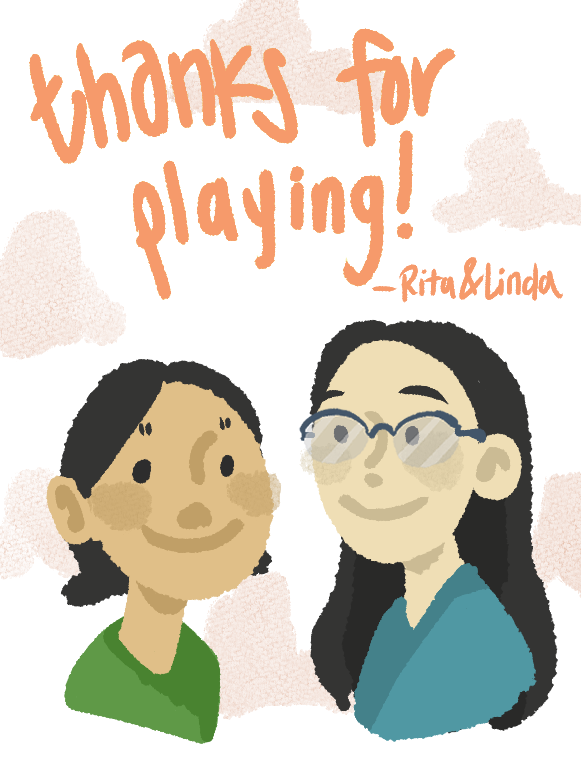
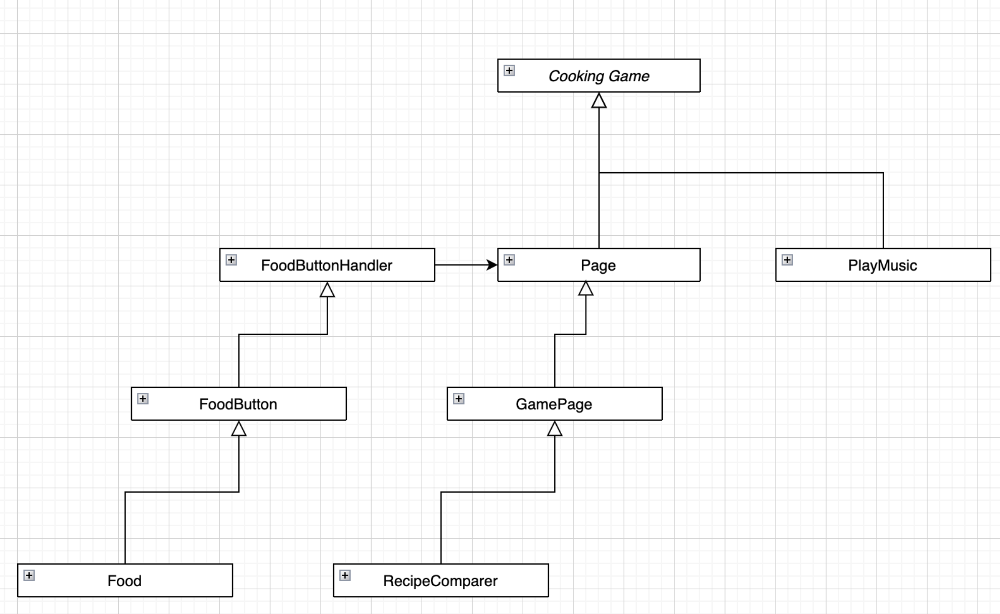
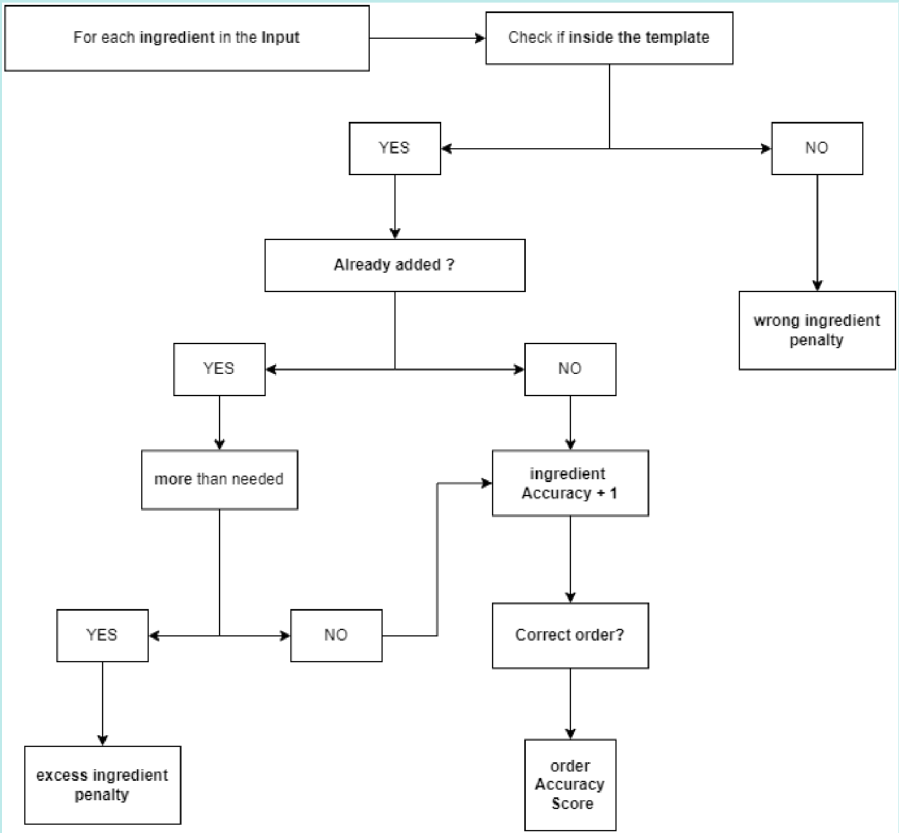

# Cooking Game

Welcome to Cooking Game! 

Cooking Game is a simple game where users must cook meals. To make a sucessful meal, they must select the correct ingredients, in the right order. For further instructions, click on the Instructions button on the Home Page. 

This game models the iconic Nintendo game, Cooking Mama, but also offers unique features. (Like users are able to add their own recipes!)

Enjoy !

Rita & Linda 

**Game Development Notes:**

For users interested in developing a similar game or editing this game, please read all the information below:

**OVERALL CLASS CONSTRUCTION:**
The entire project actively utilizes eight classes to run the game. Here is a quick draft of those classes and how they are related. A more descriptive UML diagram can be accessed [here](https://drive.google.com/file/d/1WsiNOJsooMVTKvEK7lMgyB_mNdYguPL6/view). 

**USAGE OF QUEUES, LISTS, MAPS, AND ARRAYS :**
* Queues should be used for every recipe to preserve the order at which one must make a meal
* A List is helpful when you need to add and access elements in the List continously. Please use this cautiously!
* A HashMap is used once in this code, but its role is crucial. It preserves the data structure of a recipe (recipe name, ingredients).
* An array is used once in the code, but its role is crucial. Ingredients should not be changed throughout the game; rather, it should stay consistent. 

**FOODBUTTON & FOODBUTTONHANDLER:** 
In order to treat an image as a button, the FoodButton object is essential. This button is not only reserved to Food though. It can be edited to create other Image-specific buttons. 

The FoodButton Handler is required, however, if we want to detect "button-like" states (e.g. clicked).

**PLAYMUSIC CLASS:**
The PlayMusic class is taken from Max O'Didily's Youtube Tutorial [here](https://www.youtube.com/watch?v=TErboGLHZGA&t=0s). Slight modifications were made, but overall credit goes to Max O'Didily. 

**RECIPECOMPARER CLASS:**
The RecipeComparer class algorithm is designed by Rita Li. In addition to a descriptive description of the algorithm in the javadoc, a  flow-chart of the algorithm can be seen below. 

**IMAGES:**
All images in the game are drawn by Linda Lor. The project provides some original CLIP software of the game visuals(e.g. Levels, Homepage, etc). This is provided for those who may want to continue using the same graphics, but want to add new things (a background, different colors).

**MUSIC:**
The game contains copyrighted music from Nintendo's Kirby Epic Yarn. All rights go to Nintendo; This music is simply added for UI experience.

**GRAHICS & UI:**
The game entirely relies on the Macalester kilt graphics library. Please be aware of this if you are not a Macalester student or do not have immediate accesss to this library. Other alternatives is using the traditional JFrame implementation, but this may change the code and class structure (and likely requires a lot more work!).

